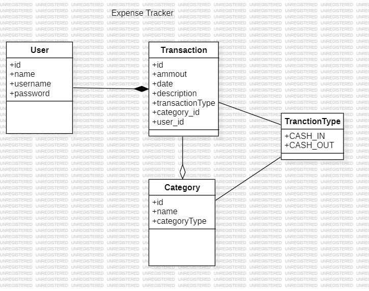

# Expense-Tracker
The Expense Tracker App is a Java-based web application built using the Spring Boot framework. This application provides users with a simple and intuitive interface to manage their expenses, track spending patterns, and gain insights into their financial activities.

 
 
 


## Table of Contents
- [Key Features](#key-features)
- [Technologies Used](#technologies-used)
- [Requirements](#requirements)
- [Installation](#installation)
- [Usage](#usage)
- [Video Presentation](#video-presentation)

## Key Features
- **Expense Management:**
Easily add, edit and categorize your expenses.
- **Transactions History:**
View detailed history of your transactions.
- **Filter Transactions:**
Can view transactions between specific period of time.
- **User Authentication:**
Secured user authentication with encrypted passwords.
- **Dashboard:**
A visual dashboard presenting a summary of your financial activities.
- **Validations**
Will show errors if the entered data is not valid.
- **Auto Descriptions**
Can generate descriptions automatically from a dataset.

## Technologies Used
- **Spring Boot**
- **Spring Security**
- **Hibernate, JPA**
- **Maven**
- **Thymeleaf**
- **Docker**

## Requirements
- **Docker**
Ensure that Docker is installed and running on your machine.

## Installation 
- **Clone project**
```
https://github.com/saadaryf/Expense-Tracker.git
```
- **Build .jar file**
```
mvn clean install
```
- **Build Image**
```
docker-compose build
```
## Usage
- **Start Containers**
```
docker-compose up -d
```
- Visit localhost:8080 on any browser.
- Sign Up or Login to access application.
- Make transactions, view results.
- Update transactions or profile if needed.
- Logout
- **Stop Containers**
```
docker-compose down
```
## Class Diagram


## Rapid Prototypes


## Video Presentation 
(click to watch)
[](https://www.youtube.com/watch?v=oKAvtq90hms)

